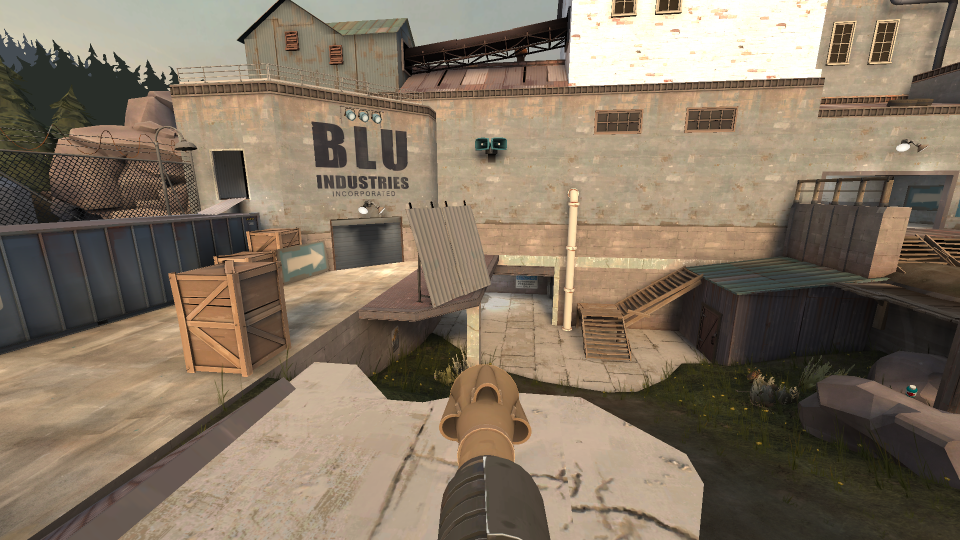
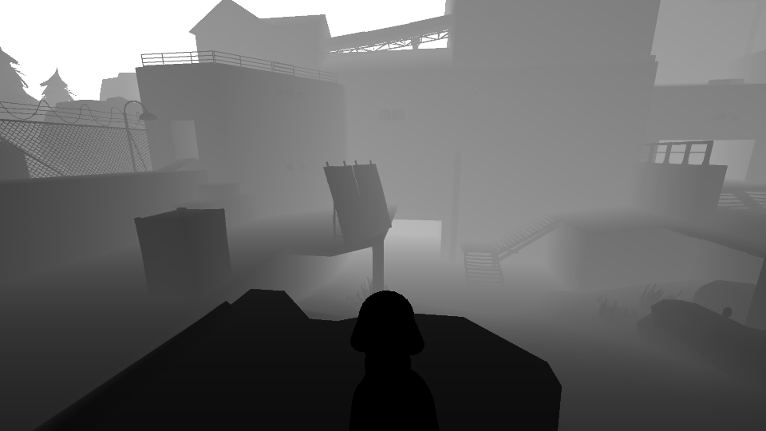

# Recording depth in TF2

This guide will go over how to capture the depth buffer when rendering out demos,
which can be then used in movie making.  
As far as I'm aware the only alternative way of doing this
is porting demos to Source Film Maker.

[TFTV thread](https://www.teamfortress.tv/56706/how-to-record-depth)

<table>
<td>

</td>

<td>

</td>

</table>

<table><tr><td>

Table of Contents

- [Recording depth in TF2](#recording-depth-in-tf2)
	- [Introduction](#introduction)
		- [Required Software](#required-software)
		- [Notes](#notes)
	- [The Guide](#the-guide)
		- [Setup](#setup)
		- [Basic Recording](#basic-recording)
		- [Advanced Recording](#advanced-recording)
	- [Changelog](#changelog)
		- [6. 2. 2021](#6-2-2021)
		- [7. 8. 2020](#7-8-2020)
		- [5. 8. 2020](#5-8-2020)
		- [3. 8. 2020](#3-8-2020)

</td></tr></table>

## Introduction

In TF2, things like character animations and ragdolls are influenced by RNG.
This means that in order for your world and depth to line up,
you have to record both at the same time, in a single pass.

I have modified the standard ReShade _DisplayDepth_ shader to show both
normal image and depth buffer side by side.
This can then be recorded using game capture software. Some extra tricks are used to control
the resolution and framerate of the footage.

### Required Software

- ReShade
- Half-Life Advanced Effects
- MSI Afterburner
- Lagarith Lossless Video Codec
- UT Video Video Codec
- StatusSpec
- ffmpeg

Some can be substituted, but I suggest you use these to avoid any unnecessary issues.

### Notes

- Lossless video takes up quite a bit of space.
  You'll probably want to have around 100 GB of free space to work with. 

- I edit in Premiere and After Effects. If you use something else,
  you may have to re-encode the footage to make it compatible.

- If you have any suggestions on how to improve this process, please do share.

## The Guide

### [Setup](guide/setup.md)
- Install and set up everything
- Only have to do this the first time

### [Basic Recording](guide/basic-recording.md)
- How you actually record

### [Advanced Recording](guide/advanced-recording.md)
- More complex stuff
- Need to know the basics first

## Changelog

### 6. 2. 2021
- Rewrote the guide
- New ReShade shader
- Ditched _SourceDemoRender_, VDMs, `startmovie`
- Now two ways to record
- Output encoded with UTVideo - fixed color loss again
- ffmpeg and ffplay included in the download

### 7. 8. 2020
- Fixed crash on `startmovie`

### 5. 8. 2020
- Restructured the guide
- Fixed color loss during video encoding
- Fixed Steam messing up ReShade

### 3. 8. 2020
- First release
