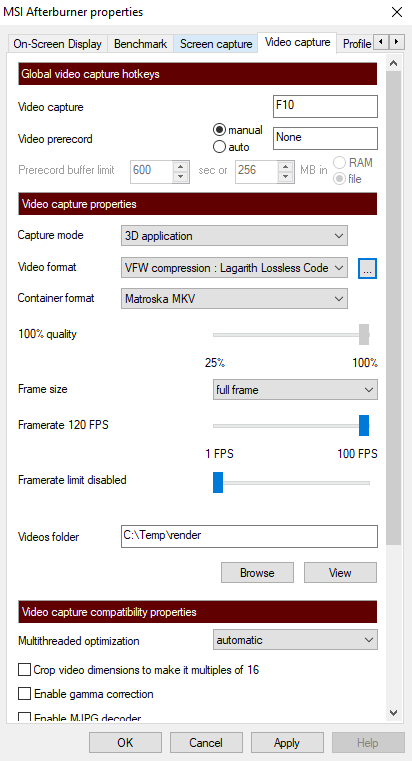
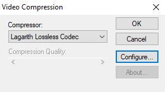
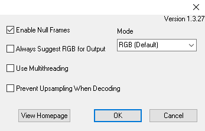
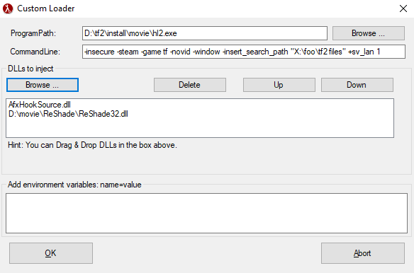
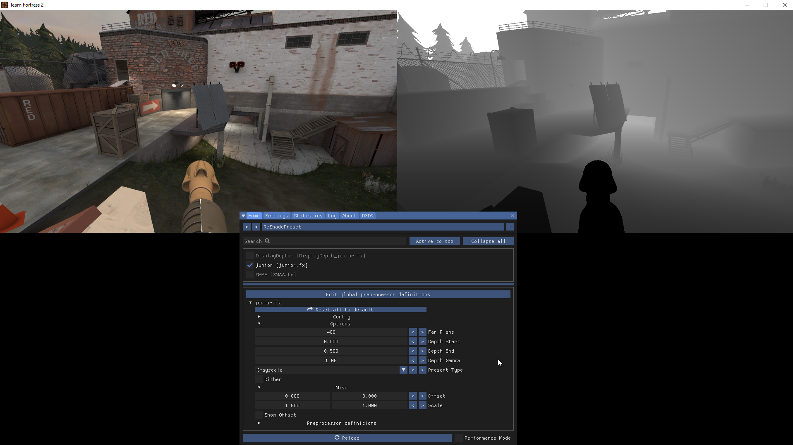

# Installation and Setup

<table><tbody><tr>
<td><details><summary>Table of Contents</summary>

- [Installation and Setup](#installation-and-setup)
	- [Download and Install](#download-and-install)
		- [Movie Making Folder](#movie-making-folder)
		- [ReShade](#reshade)
		- [Half-Life Advanced Effects (HLAE)](#half-life-advanced-effects-hlae)
		- [Lagarith Lossless Video Codec](#lagarith-lossless-video-codec)
		- [Ut Video Codec](#ut-video-codec)
		- [MSI Afterburner and RTSS](#msi-afterburner-and-rtss)
		- [StatusSpec plugin for TF2](#statusspec-plugin-for-tf2)
	- [Setup](#setup)
		- [Afterburner Capture Settings](#afterburner-capture-settings)
		- [HLAE Custom Loader](#hlae-custom-loader)
		- [ReShade](#reshade-1)
		- [Finishing Touches](#finishing-touches)

</details>

## Download and Install

### Movie Making Folder

Contains folders set up for the various programs on this list,
compiled _ffmpeg_ binaries, video processing scripts, and my ReShade shader.  
[Download from here](https://github.com/juniorsgithub/tf2-how-to-record-depth/releases/latest)
and extract somewhere (preferably not just desktop).  

&#128204; All file paths in this guide prefixed with `\` begin in this folder.

### ReShade

Post-processing injector that lets us modify the image output of the game.  
[Download  the installer](https://reshade.me/) and save it in the `\ReShade` folder.  
Run it, hold <kbd>CTRL</kbd> and click the
_Click here to select a game and manage its ReShade installation_ button.
It should extract its files right there and close.

Next, [download ReShade basic shaders](https://github.com/crosire/reshade-shaders),
open the archive, and extract `reshade-shaders-master\Shaders\ReShade.fxh`
to `\ReShade\Shaders`. If you want to get more shaders and textures you can,
but more shaders means longer launch time.

<table><tr>
<td><div style="text-align:center">

<p align="center"><sub><kbd>CTRL</kbd> + click</sub></p>
</td></div>
<td><div style="text-align:center">

<p align="center"><sub>ReShade extracted</p>
</td></div>
</tr></table>

### Half-Life Advanced Effects (HLAE)

A Source engine movie making tool. Can do many things,
we will be using it to inject ReShade.  
[Head to their website](https://www.advancedfx.org/download/)
and download the **zipped version**. Extract to `\HLAE`.

### Lagarith Lossless Video Codec

Lossless video codec that will allow us to record at maximum quality
while staying at reasonable file sizes.  
[Download the installer](https://lags.leetcode.net/codec.html) and run it.

### Ut Video Codec

Another lossless video codec we'll be using.
Required because _ffmpeg_ does not support encoding _Lagarith_.  
[Head over to their GitHub](https://github.com/umezawatakeshi/utvideo/releases/lastest)
and download the installer (file ending with `win.exe`).

### MSI Afterburner and RTSS

Recording software of choice. Afterburner can record at 120 FPS
(useful so we don't drop any frames) and supports external video codecs.  
If you don't have it already, [get it here](https://www.msi.com/page/afterburner).  
_[Feb 2021]_ The website seems to be broken. If you cannot download it, see
[this Reddit thread](https://www.reddit.com/r/MSI_Gaming/comments/k0hss7/cannot_download_msi_afterburner/).

### StatusSpec plugin for TF2

Since we'll be recording in split screen, the final footage will end up
at half the resolution of the recording.
To get around this, we need to double the recording resolution.
Unfortunately, TF2 doesn't let you go above your native display resolution.
This plugin changes that.  
Download from [TFTV thread here](https://www.teamfortress.tv/17291/sourceres/?page=2#32), open the archive, and extract the `StatusSpec\addons` folder to `\tf2 files`.

Alternatives include having a 4K monitor or some fiddling with your GPU driver.

## Setup

### Afterburner Capture Settings

Open Afterburner, click the <kbd>&#x2699;</kbd> icon to open up settings. 7th tab should be called **Video capture**, in there:
- Choose a **video capture** hotkey
- **Capture mode** to **3D application**
- **Video format** to **VFW compression**
Click the <kbd>...</kbd> button, in the menu that pops up:  
   - **Compressor** to **Lagarith Lossless Codec**
   - Click <kbd>Configure</kbd> and tick **Enable Null Frames**
   - Hit <kbd>OK</kbd> to close both dialogs, back to Video capture settings
- **Container format** to **Matroska MKV**
- The quality slider does not matter since _Lagarith_ is always lossless
- **Frame size** to **full frame**
- **Framerate** to **120 FPS**
- **Framerate limit** to **1 FPS** (disables it)
- Set your **Videos folder** to wherever you want
(make sure you have enough disk space)
- Set both **Audio source**s to **None**

120 FPS is a definitely an overkill, but you want to make sure
you capture every frame TF2 renders. 
_Lagarith_ can replace duplicate frames with null frames,
so this will have a minimal impact on file size.

<table>
<tr>
<td rowspan="2"><div style="text-align:center">

<p align="center"><sub>Video capture options</sub></p>
</td></div>
<td><div style="text-align:center">

<p align="center"><sub>Compression options</p>
</div></td>
</tr><tr>
<td><div style="text-align:center">

<p align="center"><sub>Lagarith options</p>
</td></div>
</tr>
</table>

### HLAE Custom Loader

Start `\HLAE\HLAE.exe` and navigate to **Tools** > **Developer** > **Custom Loader**,
in there:
- set **ProgramPath** to TF2's `hl2.exe`
- set **CommandLine** to this:  
	```bash <!-- language just to get string highlight -->
	-insecure -steam -game tf -novid -window -insert_search_path "X:\foo\tf2 files" +sv_lan 1
	```
  &#x2757; Replace `X:\foo\tf2 files` with the correct path to `\tf2 files`.
- **DLLs to inject** > <kbd>Browse</kbd> > add `\HLAE\AfxHookSource.dll`
- **DLLs to inject** > <kbd>Browse</kbd> > add `\ReShade\ReShade32.dll`

<table>
<td><div style="text-align:center">

<p><sub>HLAE Custom Loader</sub></p>
</td></div>
</table>

When all set, press <kbd>OK</kbd> and TF2 will launch (Steam must be running).
When the game loads try typing `mirv` and `statusspec` into console
to confirm everything has loaded successfully.
With both you should see a bunch of command suggestions.

### ReShade

In order for ReShade to work, you need to disable anti-aliasing (`mat_antialias 0`)
and UI. For the latter a keybind is preferred (`bind F9 "toggle r_drawvgui"`).
Once you have these, load up a map so you can test things out.

Hide the UI with your bind, then press <kbd>HOME</kbd> to open the ReShade overlay.
Under the **Settings** tab:
- Change **Overlay Key** if you want
- Set an **Effect Toggle Key**
- **Effect search paths** to the **full path** to `\ReShade\Shaders`

Go back to the **Home** tab and click **Reload** (at the bottom).
Wait for effects to load, then check the `junior` one.  
You should see the effect in action. If the depth part is solid white,
you probably forgot to turn off either UI or anti-aliasing.

<table>
<td><div style="text-align:center">

<p><sub>ReShade working</sub></p>
</td></div>
</table>

Note that the depth display might go blank every once in a while.
That will be taken care of once we get to the actual recording,
for now just ignore it.

Try recording a short clip with Afterburner to confirm that it works.
There is no notification if you're recording or not,
so check your videos folder to find out. When done, close TF2.

### Finishing Touches

Make a shortcut to `\HLAE\HLAE.exe`, and in it's properties add
`-customLoader -autoStart -noGui` after the path in the **Target** field,
so it looks like this:
```bash <!-- language just to get string highlight -->
"D:\tf2\movie\HLAE\HLAE.exe" -customLoader -autoStart -noGui
```
You can use this shortcut to launch TF2 though HLAE directly
without having to go though _HLAE > Tools > Developer > Custom Loader > OK_ every time.

And that is everything set up, you can now go onto
[the recording part of this guide](basic-recording.md).
